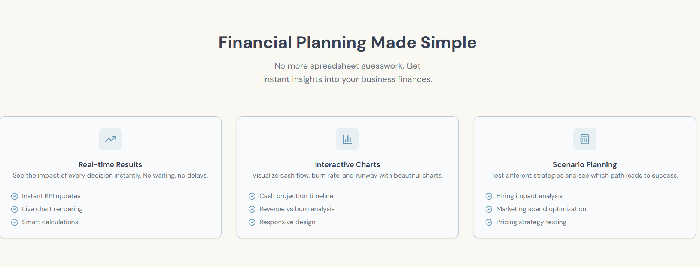
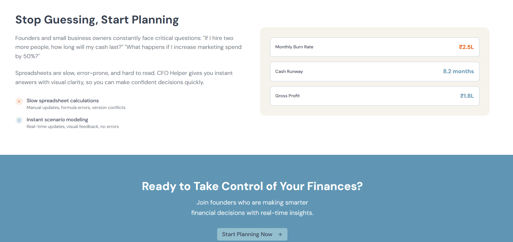
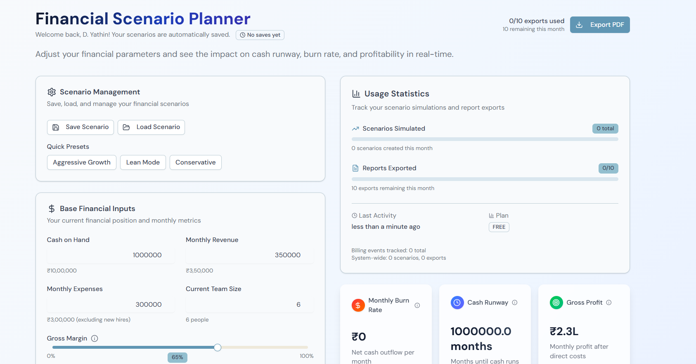
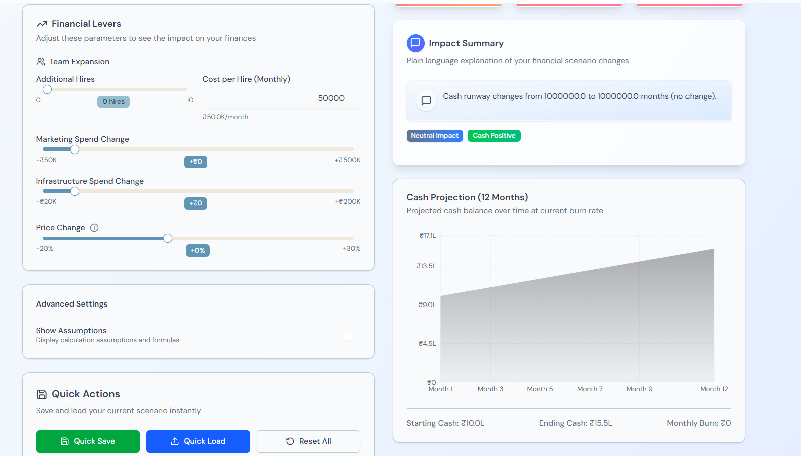
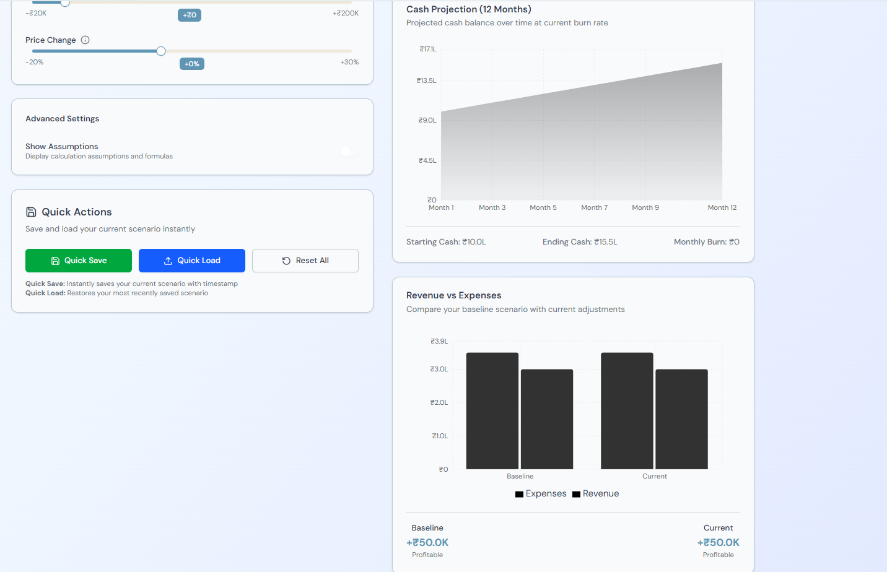
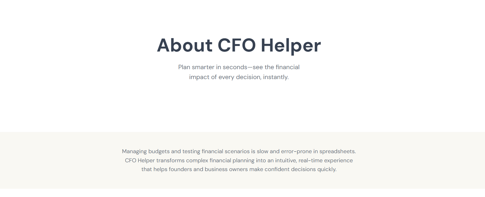
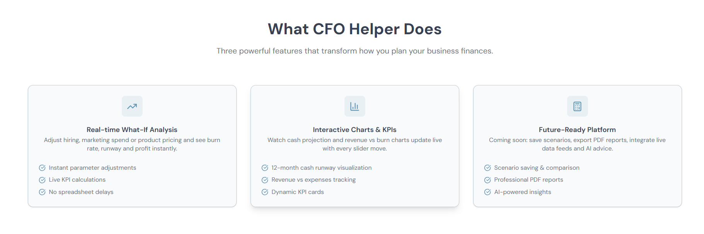
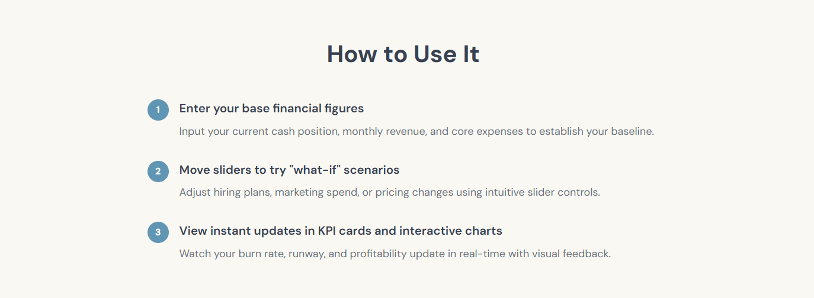
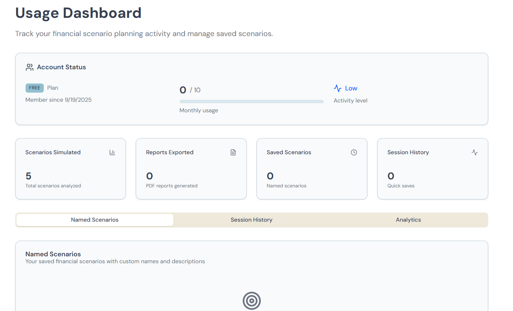

# 💰 CFO Helper – What-If Finance Simulator

CFO Helper is a full-stack web application that lets founders, event organisers, and small businesses **simulate “what-if” budget scenarios** and instantly see the effect on **burn rate, runway, and profit**.  
Users can **log in**, adjust **sliders and inputs**, **save scenarios**, and **download a PDF report** containing live charts and key metrics.

---

## ✨ Features
- **Real-time financial forecasts**  
  Adjust hiring, marketing spend, infrastructure costs, or product price and watch **KPI cards and interactive charts** update immediately.

- **Scenario management**  
  Save and reload scenarios; a **usage counter** tracks how many scenarios and reports each user has created.

- **PDF report export**  
  Generates a professional PDF including **live chart snapshots**, base inputs, lever settings, and KPIs.

- **Mock Flexprice billing events**  
  A counter bills **per scenario simulated** and **per report exported** and shows usage totals in-app.

- **Mock Pathway live-data feed**  
  Pulls **mock financial data** (e.g. revenue or expense updates) so the app can demonstrate **auto-refreshing forecasts** when fresh data arrives.

- **Secure authentication**  
  Supabase email/password auth with protected routes and session management.

---

## 🏗 Tech Stack
- **Next.js 14 + TypeScript** – Full-stack framework with App Router
- **TailwindCSS + shadcn/ui** – Modern, accessible UI components
- **Framer Motion** – Smooth animations for page and card transitions
- **Recharts** – Responsive, animated charts with gradient fills
- **Supabase** – Managed Postgres database and built-in Auth
- **@react-pdf/renderer + html-to-image** – Client-side PDF generation with embedded chart images

---

## 📸 Application Snapshots
- 
- 
- 
- 
- 
- 
- 
- 
- 
- 

## ⚡ Getting Started

### 1️⃣ Clone and install
git clone https://github.com/your-username/cfo-helper.git
cd cfo-helper
npm install
## 🚀 Setup Instructions

### 2️⃣ Create a Supabase project
Go to **[supabase.com](https://supabase.com)** and create a new project.  
In **Project Settings → API**, copy the values for:
- `NEXT_PUBLIC_SUPABASE_URL`
- `NEXT_PUBLIC_SUPABASE_ANON_KEY`

### 3️⃣ Environment variables
Create a file named **`.env.local`** in the project root and add:

NEXT_PUBLIC_SUPABASE_URL="https://YOUR-PROJECT.supabase.co"
NEXT_PUBLIC_SUPABASE_ANON_KEY="YOUR-ANON-KEY"
## 5️⃣ Run Locally

Install dependencies and start the development server:
npm install
npm run dev
